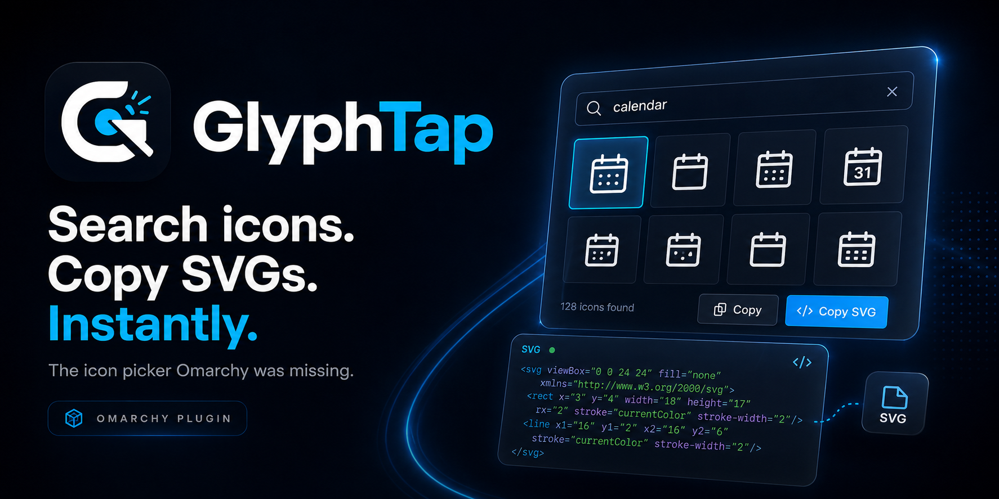

<p align="center">
  
</p>

<p align="center">
  <a href="https://github.com/invrnt/GlyphTap/releases/latest"></a>
  <a href="https://github.com/invrnt/GlyphTap/actions/workflows/ci.yml"></a>
  <a href="LICENSE"></a>
</p>

<p align="center"><strong>Find. Tap. Copy.</strong></p>

GlyphTap is the icon picker Omarchy was missing: summon a native overlay,
type `calendar`, choose with the arrow keys, press Enter, and paste a clean SVG
into Figma, code, Obsidian, or a README. It searches Iconify's broad icon
catalog without opening a browser or starting a second Quickshell process.

## Install

Install and enable GlyphTap with one command:

```bash
omarchy plugin add https://github.com/invrnt/GlyphTap.git --enable
```

Omarchy automatically adds the GlyphTap launcher to the right side of the bar.
Click the monochrome GlyphTap mark to open the icon picker; no separate setup
step is required.

To also install the `Super + I` keybinding, a searchable GlyphTap entry inside
`Super + Space`, and the short `glyphtap` command, use this complete one-command
installation instead:

```bash
omarchy plugin add https://github.com/invrnt/GlyphTap.git --enable && ~/.config/omarchy/plugins/io.github.invrnt.glyphtap/install.sh
```

If the plugin is already installed and you later decide you want those optional
shortcuts, run:

```bash
~/.config/omarchy/plugins/io.github.invrnt.glyphtap/install.sh
```

The setup validates the plugin first and changes only user-owned files. If
`Super + I` is already mentioned in your personal bindings, it stops and asks
you to choose; `--force` is available when keeping both declarations is
intentional.

## Use

1. Click the GlyphTap mark in the bar. With the optional shortcuts installed,
   you can instead press `Super + I`, choose GlyphTap from `Super + Space`, or
   run `glyphtap`.
2. Type a name such as `github`, `arrow left`, `wifi off`, or `database`.
3. Move with the arrow keys and press Enter. GlyphTap copies the selected SVG
   and closes after a brief confirmation.
4. Paste anywhere that accepts SVG or text.

The active Omarchy theme supplies the background, foreground, selection,
border, accent, corner radius, typography, and scrim automatically.

### Keyboard

| Key | Action |
|---|---|
| Type / Backspace | Search; cached results remain available offline |
| Arrow keys | Move through the result grid |
| Enter | Copy in the selected format, then close |
| Ctrl + Enter | Copy and keep GlyphTap open |
| Space | Open or close preview after moving into the grid |
| Ctrl + D | Add or remove a favorite |
| Ctrl + F | Cycle output format |
| Ctrl + S | Save an SVG to `~/Downloads` |
| Escape | Close format/preview, clear search, then close GlyphTap |

Left-click copies an icon. Right-click toggles its favorite state. The format
menu supports SVG, Iconify name, JSX, React, Vue, HTML, CSS, and Data URI.

## Fast by design

- Search requests are debounced and icon bodies are fetched in collection
  batches rather than one HTTP request per tile.
- Exact searches and recently displayed icons are cached locally, capped at
  24 MiB. If Iconify is unreachable, matching cached results still appear.
- Favorites rank first, followed by recent choices. Opening an empty GlyphTap
  shows the small personal library built from both.
- No background daemon, JavaScript package manager, account, or API key is
  required. The backend uses Python's standard library and exits after each
  bounded operation.

## Privacy and dependencies

Runtime requirements are Omarchy 4 with Quickshell, Python 3, and `wl-copy`
from `wl-clipboard`. Standard Omarchy installations already provide them; the
setup reports an exact `omarchy pkg add` command if one is missing.

Only search text is sent to `https://api.iconify.design`. GlyphTap has no
telemetry or project server. Favorites, recents, format preference, and cache
live under `${XDG_STATE_HOME:-~/.local/state}/glyphtap/`. SVG content reaches
`wl-copy` through standard input, not a shell command. See [Security](SECURITY.md)
and [third-party notices](THIRD_PARTY_NOTICES.md).

Icon collections remain subject to their respective licenses. GlyphTap shows
the collection and license label in preview; review that license before
redistributing an asset.

## Update

```bash
omarchy plugin update io.github.invrnt.glyphtap
```

If you installed the optional menu, keybinding, and command integration, refresh
it after updating:

```bash
~/.config/omarchy/plugins/io.github.invrnt.glyphtap/install.sh
```

### Migrating from 1.0.0

Version 1.1.0 adopts the maintainer's current GitHub namespace. If you tested
1.0.0 before its marketplace submission, replace the old plugin ID once:

```bash
~/.config/omarchy/plugins/io.github.juancamilogra.glyphtap/uninstall.sh
omarchy plugin remove io.github.juancamilogra.glyphtap --yes
omarchy plugin add https://github.com/invrnt/GlyphTap.git --enable --yes
~/.config/omarchy/plugins/io.github.invrnt.glyphtap/install.sh
```

Favorites, recents, and cached icons remain available because the local state
directory is unchanged.

## Uninstall

If you only use the automatic bar launcher, Omarchy removes it with the plugin:

```bash
omarchy plugin remove io.github.invrnt.glyphtap
```

If you installed the optional keybinding, menu entry, and command, remove that
integration first while preserving your personal library:

```bash
~/.config/omarchy/plugins/io.github.invrnt.glyphtap/uninstall.sh
omarchy plugin remove io.github.invrnt.glyphtap
```

Use `uninstall.sh --purge` to also remove favorites, recents, and cached icon
data. The uninstall script removes its command wrapper only when the installed
file still matches GlyphTap's copy.

## Development

```bash
./scripts/test.sh
omarchy plugin validate .
```

The test suite is offline and covers Iconify response handling, cache fallback,
clipboard boundaries, state, configuration round-trips, and the QML lifecycle
contract. See [Contributing](CONTRIBUTING.md).
